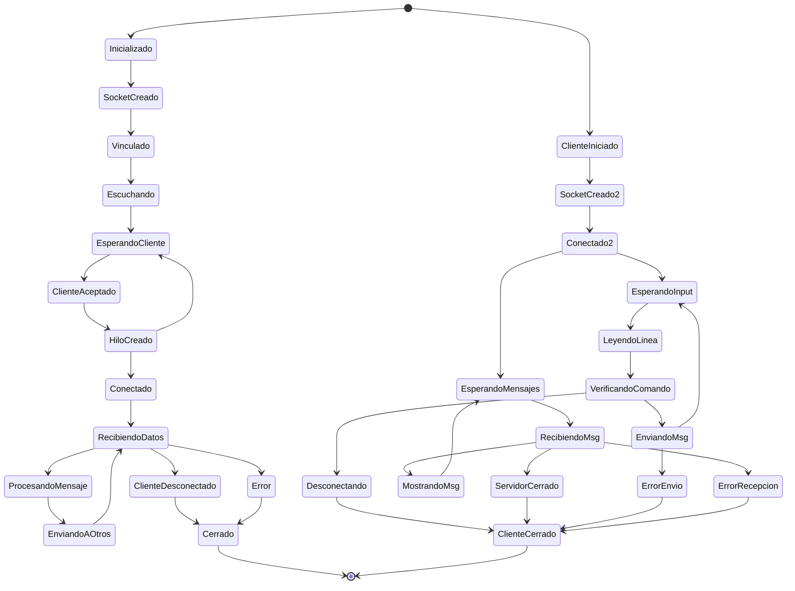

# Sistema de notificaciones 

Numero De Grupo: 4

Nombres de los integrantes: 

## Diagrama.

```mermaid
stateDiagram-v2
    [*] --> Inicializado
    
    Inicializado --> SocketCreado
    SocketCreado --> Vinculado
    Vinculado --> Escuchando
    Escuchando --> EsperandoCliente
    
    EsperandoCliente --> ClienteAceptado
    ClienteAceptado --> HiloCreado
    HiloCreado --> EsperandoCliente
    HiloCreado --> Conectado
    
    Conectado --> RecibiendoDatos
    RecibiendoDatos --> ProcesandoMensaje
    RecibiendoDatos --> ClienteDesconectado
    RecibiendoDatos --> Error
    ProcesandoMensaje --> EnviandoAOtros
    EnviandoAOtros --> RecibiendoDatos
    
    ClienteDesconectado --> Cerrado
    Error --> Cerrado
    Cerrado --> [*]
    
    [*] --> ClienteIniciado
    ClienteIniciado --> SocketCreado2
    SocketCreado2 --> Conectado2
    Conectado2 --> EsperandoInput
    Conectado2 --> EsperandoMensajes
    
    EsperandoInput --> LeyendoLinea
    LeyendoLinea --> VerificandoComando
    VerificandoComando --> Desconectando
    VerificandoComando --> EnviandoMsg
    EnviandoMsg --> EsperandoInput
    EnviandoMsg --> ErrorEnvio
    
    EsperandoMensajes --> RecibiendoMsg
    RecibiendoMsg --> MostrandoMsg
    RecibiendoMsg --> ServidorCerrado
    RecibiendoMsg --> ErrorRecepcion
    MostrandoMsg --> EsperandoMensajes
    
    Desconectando --> ClienteCerrado
    ServidorCerrado --> ClienteCerrado
    ErrorEnvio --> ClienteCerrado
    ErrorRecepcion --> ClienteCerrado
    ClienteCerrado --> [*]
```
